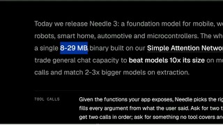

# Needle 3

## What it is

Cactus 8–29 MB on-device tool-calling model with laddered 2–20 layer cuts for phones, MCU, and edge.

| | |
|:---:|:---:|
|  |  |

## Why keep

Wire into smart-home, wearables, or MCU agents when you need schema-constrained tool calls and extraction without a cloud LLM.

## When to reach for it

Deploying local automation (`pip install cactus-needle` / `.cact` + sub-1 MB engine) where chat quality does not matter and empty refusals on uncovered tools are correct.

## Caveats

Apache-2.0. Not a general chat model by design. Full 20-layer CQ2 ship is still tens of MB of RAM depending on platform; fine-tune for narrow tool sets before expecting Flash-class scores. Proprietary 2-bit post-train data stays on Cactus Platform.

## Links

- Homepage: https://cactuscompute.com/needle
- GitHub: https://github.com/cactus-compute/needle
- Weights: https://huggingface.co/Cactus-Compute/needle3
