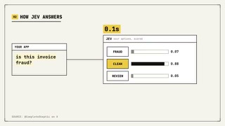
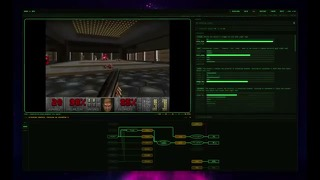

# Jev

## What it is

TypeSafe System One API: state in, schema-bound probabilistic decisions out in 70–500 ms (not a chat model).

| | |
|:---:|:---:|
|  |  |
|  | |

## Why keep

Wire as a middle layer for routing, triage, guardrails, and agent tool-choice when you need calibrated confidence and cannot tolerate off-schema outputs.

## When to reach for it

High-frequency structured decisions (`POST /v1/systemone`, Noul/Choice/Score) where chat LLMs are too slow or too loose, and empty/wrong-but-valid options are handled with thresholds.

## Caveats

Early-access waitlist (also via Vercel/Cloudflare gateways). About $0.042 / MTok input, output free; ~64k context for state + questions. “0% hallucination” is structural schema safety, not perfect accuracy. No free-form generation.

## Links

- Homepage: https://typesafe.ai/
- Intro post: https://typesafe.ai/blog/introducing-system-one-models-and-jev
- API reference: https://jevapi.dev/
