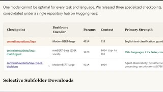
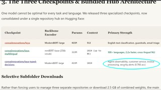

# Laya

## What it is

Open Apache-2.0 System One decision model: state + typed questions → calibrated probabilities in ~33 ms locally.

| | |
|:---:|:---:|
|  |  |
|  | |

## Why keep

Local alternative to closed Jev for routing, triage, guardrails, and agent supervision when you need schema-bound decisions without an API meter.

## When to reach for it

`pip install laya` with Router (English / multilingual / typed-decisions checkpoints) on a consumer GPU or CPU when choice sets stay small and you can fine-tune or temperature-calibrate for the domain.

## Caveats

Base checkpoints are weak zero-shot on typed-decisions; strong scores come from fine-tuned checkpoints. Keep choices under ~20 options (or raise head budget / coarse-to-fine). English root fails on non-Latin scripts while staying overconfident; use multilingual + Router. Roundup called it “Leia.”

## Links

- Homepage: https://laya.convaiinnovations.com/
- GitHub: https://github.com/NandhaKishorM/laya
- Weights: https://huggingface.co/convaiinnovations/laya
