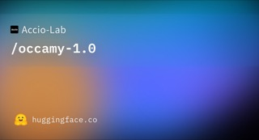

# Occamy-1.0

## What it is

Accio Lab agentic co-work MoE (35B/3B active) post-trained from Qwen3.6-35B-A3B for long-horizon tool and coding work.

| | |
|:---:|:---:|
|  | |

## Why keep

Compare when choosing an open local agent for sustained terminal/file/API workflows where intelligence-per-cost matters more than peak frontier scores.

## When to reach for it

vLLM/SGLang serving (or GGUF quants from ~11 GB up) for Claw-style co-work, tool calling, and coding agents; training stack Dressage is also open.

## Caveats

Apache 2.0. Full BF16 path wants multi-GPU (docs show 8-way TP for 262K). Not trained for native browser/desktop vision loops. Roundup ASR called it “Okami.”

## Links

- Homepage: https://huggingface.co/Accio-Lab/occamy-1.0
- GitHub: https://github.com/Accio-Lab/occamy
- Weights: https://huggingface.co/Accio-Lab/occamy-1.0
- GGUF: https://huggingface.co/Accio-Lab/occamy-1.0-GGUF
- Paper: https://arxiv.org/abs/2609.11977
