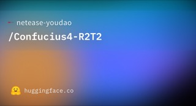

# Confucius4-R2T2

## What it is

NetEase Youdao true-streaming ASR: append-only committed text, low latency, local weights on Qwen3-ASR.

| | |
|:---:|:---:|
|  | |

## Why keep

Wire into live captioning or voice-agent pipelines when partial transcript flicker would corrupt downstream actions.

## When to reach for it

Need local streaming speech-to-text with stable prefixes (about 200–600 ms latency; chunks from 80 ms to 2 s), especially Chinese/English, with optional hotword context.

## Caveats

Code is Apache 2.0; weights use NetEase’s Model Use License. Checkpoint is about 4 GB BF16 (2B params). Inference path leans on vLLM / Qwen3-ASR Docker; confirm CUDA pin before install.

## Links

- Homepage: https://huggingface.co/netease-youdao/Confucius4-R2T2
- GitHub: https://github.com/netease-youdao/Confucius4-R2T2
- Weights: https://huggingface.co/netease-youdao/Confucius4-R2T2
