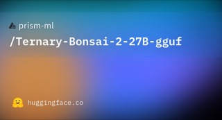

# Ternary Bonsai 2 27B

## What it is

PrismML ternary compression of Qwen3.8-27B to ~5.9 GB with claimed ~98% benchmark retention (Apache 2.0).

| | |
|:---:|:---:|
|  | |

## Why keep

Compare when you want 27B-class local coding/vision/agent work in a mid-consumer VRAM envelope instead of full FP16 (~54 GB).

## When to reach for it

Local multimodal loops on CUDA or Apple MLX where footprint and energy/token matter more than stock-runtime convenience.

## Caveats

Requires PrismML’s llama.cpp fork (GGUF PTQ1_0/PQ2_0) or their MLX loader; stock llama.cpp/Ollama can reject files or emit garbage without warning. Roundup said “Bonsai 227B.” MLX pack on disk is larger (~8.6 GB with vision tower).

## Links

- Homepage: https://prismml.com/news/bonsai-2-27b
- Weights (GGUF): https://huggingface.co/prism-ml/Ternary-Bonsai-2-27B-gguf
- Weights (MLX): https://huggingface.co/prism-ml/Ternary-Bonsai-2-27B-mlx-2bit
